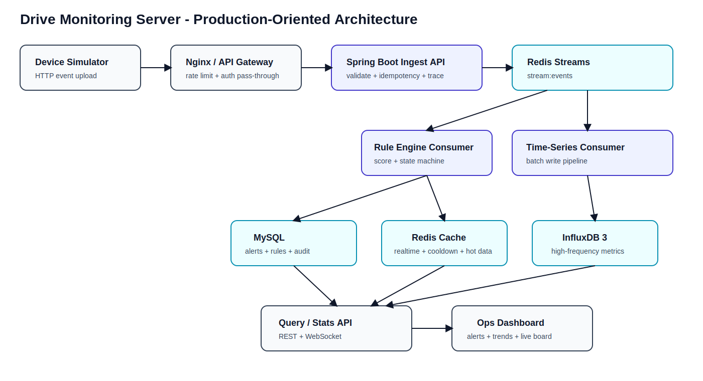
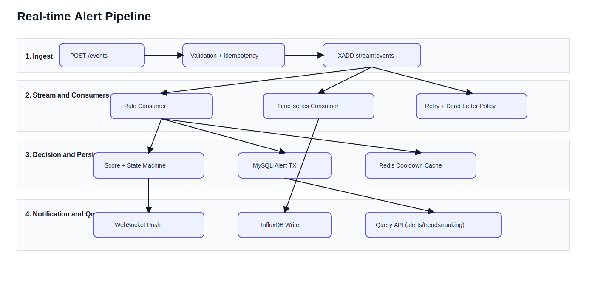
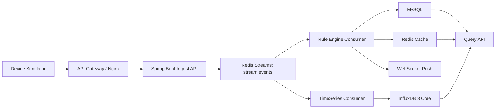
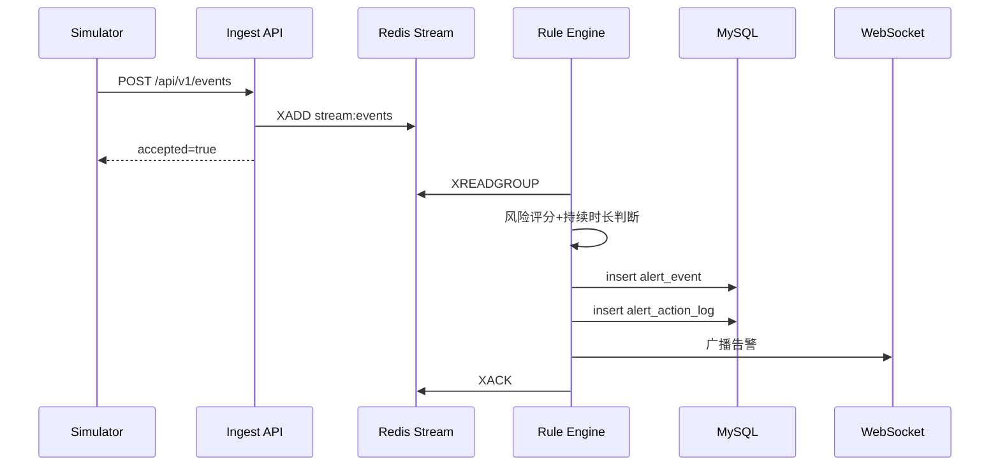
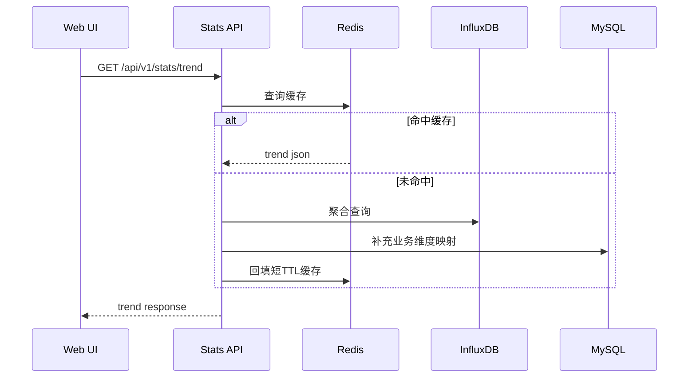

# 总体架构设计说明书（HLD）

## 1. 设计目标
1. 保证实时告警链路低延迟与可扩展。
2. 保证业务数据可追溯、可审计。
3. 适配个人开发者节奏，先模块化单体，再平滑演进到分布式。

## 2. 技术架构总览

图示说明：
1. 事件上报进入接入层后立即异步入流，避免接口阻塞。
2. 规则判定和时序写入拆分为独立消费者，互不影响。
3. 查询层组合 MySQL、Redis、InfluxDB 结果，兼顾实时与历史分析。

## 3. 架构演进策略
### 阶段A：模块化单体（当前推荐起步）
- 优点：开发快、部署简单、适合个人维护。
- 约束：模块边界要清晰，避免“单体泥球化”。

### 阶段B：按压力拆分服务
- 当写入压力上升时，先拆 `ingest` 与 `rule-engine`。
- 当查询压力上升时，拆 `stats-service`。
- 保持数据库边界稳定，避免过早拆库。

### 阶段C：平台化增强
- 引入集中配置中心与服务治理。
- 引入可观测性平台和统一告警通道。
- 建立发布流水线与灰度机制。

## 4. 实时链路可视化

图示说明：
1. 规则计算失败不会直接丢消息，而是重试或进入死信流。
2. Influx 写入异常不阻塞主告警链路。
3. 告警与查询链路分离，保证响应稳定性。

## 5. 模块划分

## 3. 模块划分
| 模块 | 责任 | 依赖 |
|---|---|---|
| `auth-module` | 登录、JWT签发、RBAC鉴权 | MySQL |
| `ingest-module` | 事件接入、参数校验、幂等处理 | Redis |
| `stream-module` | Stream生产与消费封装 | Redis |
| `rule-module` | 风险评分、状态机、冷却策略 | Redis/MySQL |
| `alert-module` | 告警创建、更新、操作日志 | MySQL |
| `timeseries-module` | InfluxDB写入与查询封装 | InfluxDB |
| `stats-module` | 趋势/排行/报表 | MySQL/InfluxDB/Redis |
| `realtime-module` | WebSocket会话与广播 | Redis |
| `ops-module` | 健康检查、审计、指标 | 全部 |

## 6. 逻辑分层
1. 接入层：Controller + DTO校验 + 统一异常处理。
2. 应用层：用例编排，保证事务边界和幂等逻辑。
3. 领域层：规则判定、告警状态流转等核心业务。
4. 基础设施层：MySQL、Redis、InfluxDB、WebSocket、审计。

## 7. 核心时序流程
### 5.1 实时告警链路

### 5.2 趋势查询链路

## 8. 存储职责边界
| 数据类型 | 存储 | 理由 |
|---|---|---|
| 告警主数据 | MySQL | 强一致事务、可审计 |
| 用户与权限 | MySQL | 关系模型清晰 |
| 高频指标 | InfluxDB | 高写入吞吐、时序聚合 |
| 热点状态 | Redis | 低延迟读写 |
| 事件流 | Redis Streams | 异步解耦、消费组扩展 |

## 9. 高可用与扩展策略
1. Spring Boot 无状态化，可横向扩容。
2. Redis Streams 消费组支持多消费者并行。
3. MySQL 采用主从备份策略，开发阶段可单实例，生产建议主从高可用。
4. InfluxDB 配置保留策略，控制存储增长。
5. WebSocket 节点多实例时，使用 Redis Pub/Sub 同步广播。

## 10. 异常处理策略
1. 上报接口失败：返回标准错误码并记录 traceId。
2. 消费失败：消息留在 PEL，重试超过阈值进入死信集合。
3. DB异常：事务回滚，不确认 Stream 消息，等待重试。
4. Influx写入失败：写失败队列，定时补偿。

## 11. 可观测性
1. 指标：QPS、P95、错误率、消费延迟、积压长度。
2. 日志：接入日志、规则命中日志、告警流转日志、审计日志。
3. 链路：traceId 在 API、Stream、DB日志中贯穿。
