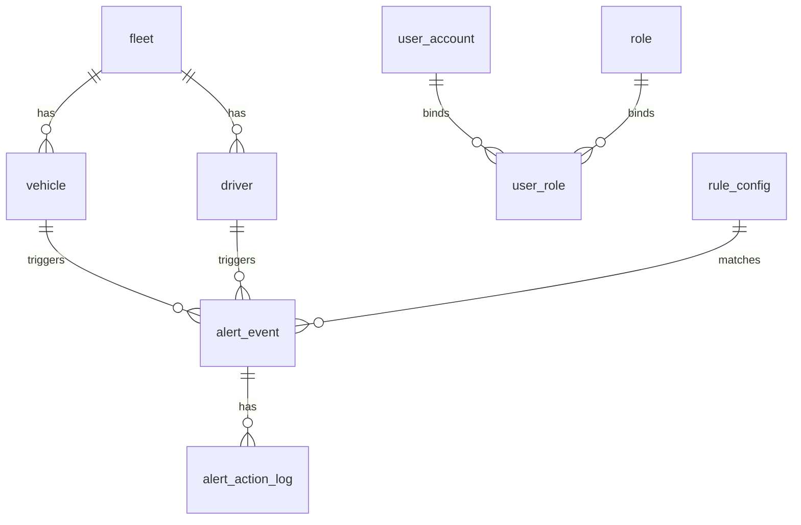

# MySQL 数据库设计文档

## 1. 设计目标
1. 支撑业务主数据与告警闭环的事务一致性。
2. 支撑高频查询场景下的可用索引策略。
3. 具备可审计、可归档、可扩展能力。

## 2. 数据库规范
- 版本建议：MySQL 8.0+
- 字符集：`utf8mb4`
- 排序规则：`utf8mb4_general_ci`
- 引擎：`InnoDB`
- 时间字段：统一 `datetime(3)`（毫秒）
- 主键：`bigint` 自增或雪花ID（生产推荐雪花ID）

## 3. ER 关系图


## 4. 表结构定义
### 4.1 用户与权限
```sql
CREATE TABLE user_account (
  id BIGINT PRIMARY KEY AUTO_INCREMENT,
  username VARCHAR(64) NOT NULL,
  password_hash VARCHAR(255) NOT NULL,
  nickname VARCHAR(64) DEFAULT NULL,
  status TINYINT NOT NULL DEFAULT 1 COMMENT '1=启用,0=禁用',
  created_at DATETIME(3) NOT NULL,
  updated_at DATETIME(3) NOT NULL,
  UNIQUE KEY uk_username (username)
) ENGINE=InnoDB DEFAULT CHARSET=utf8mb4;

CREATE TABLE role (
  id BIGINT PRIMARY KEY AUTO_INCREMENT,
  role_code VARCHAR(32) NOT NULL COMMENT 'SUPER_ADMIN/SYS_ADMIN/RISK_ADMIN/OPERATOR/ANALYST/VIEWER',
  role_name VARCHAR(64) NOT NULL,
  created_at DATETIME(3) NOT NULL,
  updated_at DATETIME(3) NOT NULL,
  UNIQUE KEY uk_role_code (role_code)
) ENGINE=InnoDB DEFAULT CHARSET=utf8mb4;

CREATE TABLE user_role (
  id BIGINT PRIMARY KEY AUTO_INCREMENT,
  user_id BIGINT NOT NULL,
  role_id BIGINT NOT NULL,
  created_at DATETIME(3) NOT NULL,
  UNIQUE KEY uk_user_role (user_id, role_id),
  KEY idx_user_id (user_id),
  KEY idx_role_id (role_id)
) ENGINE=InnoDB DEFAULT CHARSET=utf8mb4;
```

### 4.2 业务主数据
```sql
CREATE TABLE fleet (
  id BIGINT PRIMARY KEY AUTO_INCREMENT,
  fleet_code VARCHAR(64) NOT NULL,
  fleet_name VARCHAR(128) NOT NULL,
  status TINYINT NOT NULL DEFAULT 1,
  created_at DATETIME(3) NOT NULL,
  updated_at DATETIME(3) NOT NULL,
  UNIQUE KEY uk_fleet_code (fleet_code)
) ENGINE=InnoDB DEFAULT CHARSET=utf8mb4;

CREATE TABLE vehicle (
  id BIGINT PRIMARY KEY AUTO_INCREMENT,
  fleet_id BIGINT NOT NULL,
  vehicle_code VARCHAR(64) NOT NULL,
  plate_no VARCHAR(32) NOT NULL,
  status TINYINT NOT NULL DEFAULT 1,
  created_at DATETIME(3) NOT NULL,
  updated_at DATETIME(3) NOT NULL,
  UNIQUE KEY uk_vehicle_code (vehicle_code),
  KEY idx_fleet_id (fleet_id),
  KEY idx_plate_no (plate_no)
) ENGINE=InnoDB DEFAULT CHARSET=utf8mb4;

CREATE TABLE driver (
  id BIGINT PRIMARY KEY AUTO_INCREMENT,
  fleet_id BIGINT NOT NULL,
  driver_code VARCHAR(64) NOT NULL,
  driver_name VARCHAR(64) NOT NULL,
  phone VARCHAR(32) DEFAULT NULL,
  status TINYINT NOT NULL DEFAULT 1,
  created_at DATETIME(3) NOT NULL,
  updated_at DATETIME(3) NOT NULL,
  UNIQUE KEY uk_driver_code (driver_code),
  KEY idx_fleet_id (fleet_id),
  KEY idx_driver_name (driver_name)
) ENGINE=InnoDB DEFAULT CHARSET=utf8mb4;
```

### 4.3 规则配置
```sql
CREATE TABLE rule_config (
  id BIGINT PRIMARY KEY AUTO_INCREMENT,
  rule_code VARCHAR(64) NOT NULL,
  rule_name VARCHAR(128) NOT NULL,
  risk_threshold DECIMAL(5,4) NOT NULL,
  duration_seconds INT NOT NULL,
  cooldown_seconds INT NOT NULL,
  enabled TINYINT NOT NULL DEFAULT 1,
  version INT NOT NULL DEFAULT 1,
  created_by BIGINT NOT NULL,
  updated_by BIGINT NOT NULL,
  created_at DATETIME(3) NOT NULL,
  updated_at DATETIME(3) NOT NULL,
  UNIQUE KEY uk_rule_code (rule_code),
  KEY idx_enabled (enabled)
) ENGINE=InnoDB DEFAULT CHARSET=utf8mb4;
```

### 4.4 事件头表（可选）
```sql
CREATE TABLE event_header (
  id BIGINT PRIMARY KEY AUTO_INCREMENT,
  event_id VARCHAR(64) NOT NULL,
  fleet_id BIGINT NOT NULL,
  vehicle_id BIGINT NOT NULL,
  driver_id BIGINT NOT NULL,
  event_time DATETIME(3) NOT NULL,
  received_time DATETIME(3) NOT NULL,
  trace_id VARCHAR(64) NOT NULL,
  UNIQUE KEY uk_event_id (event_id),
  KEY idx_vehicle_event_time (vehicle_id, event_time),
  KEY idx_driver_event_time (driver_id, event_time)
) ENGINE=InnoDB DEFAULT CHARSET=utf8mb4;
```

### 4.5 告警主表
```sql
CREATE TABLE alert_event (
  id BIGINT PRIMARY KEY AUTO_INCREMENT,
  alert_no VARCHAR(64) NOT NULL,
  fleet_id BIGINT NOT NULL,
  vehicle_id BIGINT NOT NULL,
  driver_id BIGINT NOT NULL,
  rule_id BIGINT NOT NULL,
  risk_level TINYINT NOT NULL COMMENT '1低2中3高',
  risk_score DECIMAL(5,4) NOT NULL,
  fatigue_score DECIMAL(5,4) NOT NULL,
  distraction_score DECIMAL(5,4) NOT NULL,
  edge_risk_level VARCHAR(32) DEFAULT NULL,
  edge_dominant_risk_type VARCHAR(32) DEFAULT NULL,
  edge_trigger_reasons VARCHAR(255) DEFAULT NULL,
  edge_window_start_ms BIGINT DEFAULT NULL,
  edge_window_end_ms BIGINT DEFAULT NULL,
  edge_created_at_ms BIGINT DEFAULT NULL,
  trigger_time DATETIME(3) NOT NULL,
  status TINYINT NOT NULL DEFAULT 0 COMMENT '0新建1确认2误报3关闭',
  latest_action_by BIGINT DEFAULT NULL,
  latest_action_time DATETIME(3) DEFAULT NULL,
  remark VARCHAR(255) DEFAULT NULL,
  created_at DATETIME(3) NOT NULL,
  updated_at DATETIME(3) NOT NULL,
  UNIQUE KEY uk_alert_no (alert_no),
  KEY idx_vehicle_time (vehicle_id, trigger_time),
  KEY idx_driver_time (driver_id, trigger_time),
  KEY idx_status_time (status, trigger_time),
  KEY idx_level_status (risk_level, status)
) ENGINE=InnoDB DEFAULT CHARSET=utf8mb4;
```

说明：
1. `alert_event` 同时承担系统内“告警/警告”统一主表职责。
2. `edge_*` 字段保留边缘端原始风险判断和时间窗元数据。
3. `rule_id` / `risk_score` 仍保留，用于兼容既有规则、筛选和报表能力。

### 4.6 告警操作日志
```sql
CREATE TABLE alert_action_log (
  id BIGINT PRIMARY KEY AUTO_INCREMENT,
  alert_id BIGINT NOT NULL,
  action_type VARCHAR(32) NOT NULL COMMENT 'CREATE/CONFIRM/FALSE_POSITIVE/CLOSE',
  action_by BIGINT NOT NULL,
  action_time DATETIME(3) NOT NULL,
  action_remark VARCHAR(255) DEFAULT NULL,
  created_at DATETIME(3) NOT NULL,
  KEY idx_alert_id_time (alert_id, action_time),
  KEY idx_action_by_time (action_by, action_time)
) ENGINE=InnoDB DEFAULT CHARSET=utf8mb4;
```

### 4.7 审计与报表
```sql
CREATE TABLE system_audit_log (
  id BIGINT PRIMARY KEY AUTO_INCREMENT,
  operator_id BIGINT NOT NULL,
  operator_name VARCHAR(64) NOT NULL,
  module VARCHAR(64) NOT NULL,
  action VARCHAR(64) NOT NULL,
  target_id VARCHAR(64) DEFAULT NULL,
  detail_json JSON DEFAULT NULL,
  ip VARCHAR(64) DEFAULT NULL,
  created_at DATETIME(3) NOT NULL,
  KEY idx_operator_time (operator_id, created_at),
  KEY idx_module_time (module, created_at)
) ENGINE=InnoDB DEFAULT CHARSET=utf8mb4;

CREATE TABLE daily_report (
  id BIGINT PRIMARY KEY AUTO_INCREMENT,
  report_date DATE NOT NULL,
  fleet_id BIGINT NOT NULL,
  total_events BIGINT NOT NULL,
  total_alerts BIGINT NOT NULL,
  high_risk_alerts BIGINT NOT NULL,
  false_positive_count BIGINT NOT NULL,
  avg_risk_score DECIMAL(5,4) NOT NULL,
  created_at DATETIME(3) NOT NULL,
  updated_at DATETIME(3) NOT NULL,
  UNIQUE KEY uk_date_fleet (report_date, fleet_id)
) ENGINE=InnoDB DEFAULT CHARSET=utf8mb4;
```

## 5. 索引策略说明
1. 查询热路径优先：`vehicle_id + trigger_time`、`driver_id + trigger_time`。
2. 状态类筛选优先：`status + trigger_time`。
3. 规则报表优先：`risk_level + status`。
4. 审计按操作人和模块维度建立时间索引。

## 6. 分区与归档建议
1. 初期可不做分区，数据量上升后按月分区。
2. 数据量提升后，`alert_event` 可按月分区。
3. 历史归档策略：
   - 告警明细保留 1~2 年。
   - 审计日志保留 180 天以上。

## 7. 数据一致性策略
1. 告警创建与操作日志写入在同一事务内。
2. 状态更新采用乐观锁（可选 `version` 字段）。
3. 幂等事件通过 `event_id` 唯一键保证不重复处理。

## 8. Flyway 迁移清单（当前实现）
1. `V1__init_core_tables.sql`：初始化 `user_account`、`rule_config`、`alert_event`、`alert_action_log`、`system_audit_log`。
2. `V2__seed_default_data.sql`：初始化默认管理员账号与默认规则数据。
3. `V3__init_auth_rbac.sql`：初始化 `role`、`user_role` 及默认角色绑定。
4. `V4__strengthen_user_rule_alert_audit_schema.sql`：补充基础完整性约束。

`V4` 约束补强范围：
1. `user`：`user_account.status` 检查约束。
2. `rule`：`rule_config` 的阈值、时长、开关、版本检查约束。
3. `alert`：`alert_event` 和 `alert_action_log` 的状态/分值/动作类型检查约束，以及关联外键。
4. `audit`：`system_audit_log.operator_id` 到 `user_account.id` 的外键约束。
