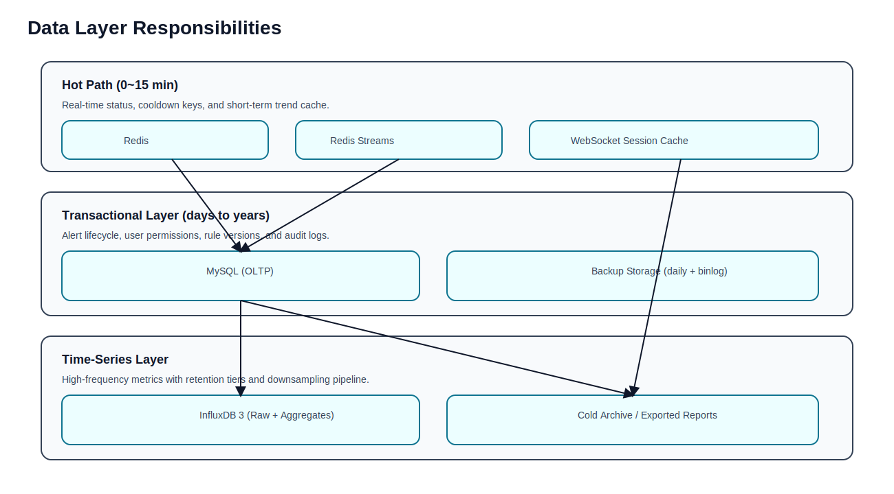

# InfluxDB 3 Core 设计文档

## 1. 目标与定位
InfluxDB 负责承载高频时序指标，提供高吞吐写入和按时间窗口聚合分析能力，避免 MySQL 承担大量时序扫描压力。



图示说明：
1. Redis 承载分钟级热点与状态，避免高频访问直打数据库。
2. MySQL 承载事务与审计闭环，保证一致性与可追溯。
3. InfluxDB 承载高频指标并配合降采样，控制长期存储成本。

## 2. 数据建模
### 2.1 逻辑结构
- Database：`drive_monitor`
- Table：`driver_metrics`

### 2.2 标签与字段
| 类型 | 字段 | 说明 |
|---|---|---|
| Tag | fleet_id | 车队标识 |
| Tag | vehicle_id | 车辆标识 |
| Tag | driver_id | 司机标识 |
| Tag | algorithm_ver | 算法版本 |
| Field | fatigue_score | 疲劳分数（0~1） |
| Field | distraction_score | 分心分数（0~1） |
| Field | perclos | 眼睑闭合比例（0~1） |
| Field | blink_rate | 眨眼率 |
| Field | yawn_count | 哈欠次数 |
| Field | risk_score | 风险综合分数 |
| Field | risk_level | 风险等级（1/2/3） |
| Timestamp | event_time | 事件时间 |

### 2.3 写入示例（Line Protocol）
```text
driver_metrics,fleet_id=fleet_01,vehicle_id=veh_001,driver_id=drv_001,algorithm_ver=v1.0.3 fatigue_score=0.82,distraction_score=0.64,perclos=0.41,blink_rate=0.28,yawn_count=2i,risk_score=0.739,risk_level=2i 1775556075000000000
```

## 3. 写入链路设计
1. 事件进入 Redis Streams。
2. `timeseries-consumer` 消费并转换为 Influx 写入模型。
3. 批量写入（建议 100~500 条/批）提升吞吐。
4. 写失败记录到补偿队列，重试并限制次数。

## 4. 查询模型
### 4.1 趋势查询（按5分钟）
```sql
SELECT
  date_bin(INTERVAL '5 minutes', time, TIMESTAMP '1970-01-01T00:00:00Z') AS bucket,
  avg(risk_score) AS avg_risk_score,
  avg(fatigue_score) AS avg_fatigue_score,
  avg(distraction_score) AS avg_distraction_score
FROM driver_metrics
WHERE fleet_id = 'fleet_01'
  AND time >= TIMESTAMP '2026-04-01T00:00:00Z'
  AND time < TIMESTAMP '2026-04-08T00:00:00Z'
GROUP BY bucket
ORDER BY bucket;
```

### 4.2 司机风险排行
```sql
SELECT
  driver_id,
  avg(risk_score) AS avg_risk,
  count(*) AS sample_count
FROM driver_metrics
WHERE time >= TIMESTAMP '2026-04-01T00:00:00Z'
  AND time < TIMESTAMP '2026-04-08T00:00:00Z'
GROUP BY driver_id
ORDER BY avg_risk DESC
LIMIT 10;
```

## 5. 数据保留与降采样
建议分层策略：
1. 原始数据：保留 30 天。
2. 5分钟聚合数据：保留 180 天。
3. 小时级聚合数据：保留 2 年。

实现方式：
1. 定时任务查询原始数据并写入聚合表。
2. 超过保留期的数据按策略清理。

## 6. 容量预估
以 `200 events/s` 估算：
1. 每日事件量约 1728 万。
2. 单条行压缩后按 80~150 字节估算。
3. 原始数据 30 天规模可达百 GB 级，必须启用分层留存。

## 7. 可靠性设计
1. 写入采用批处理 + 重试 + 退避。
2. 与业务链路解耦，Influx 不可用时不阻塞告警主链路。
3. 通过监控告警写入失败率和延迟积压。

## 8. 运维与监控指标
1. 写入 TPS、写入失败率、写入延迟。
2. 查询 P95 延迟。
3. 存储占用与增长速率。
4. 各聚合任务执行时长与成功率。
