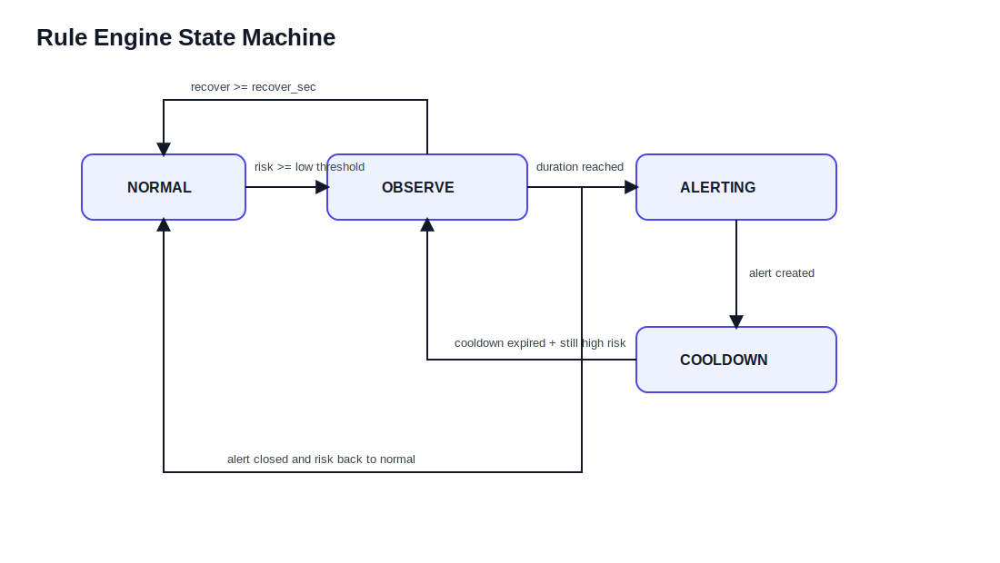
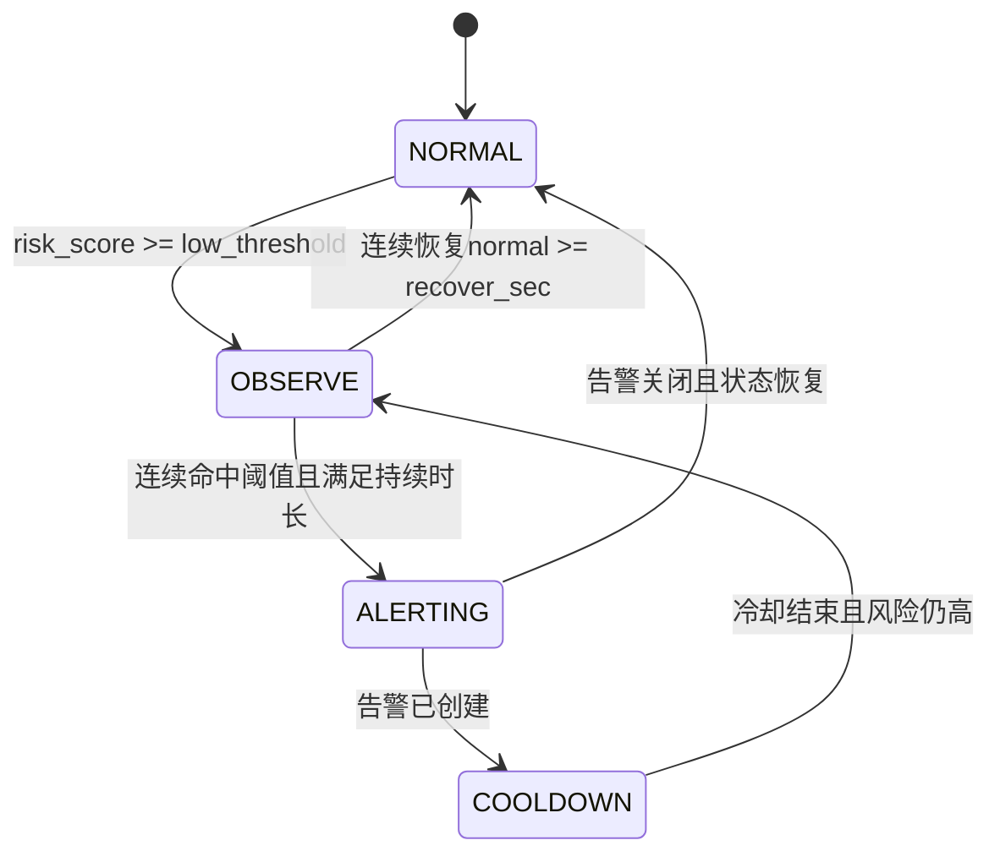

# 规则引擎设计文档

## 1. 设计目标
1. 对实时事件进行低延迟风险判定。
2. 支持规则可配置、可灰度、可审计。
3. 支持误报抑制与告警风暴控制。

图示说明：
1. `NORMAL -> OBSERVE` 用于吸收短时抖动，减少误报。
2. `ALERTING -> COOLDOWN` 限制重复告警，防止告警风暴。
3. `recover_sec` 保证恢复状态切换具备稳定性。

## 2. 规则模型
## 2.1 核心公式
`risk_score = max(fatigue_score, distraction_score)`

## 2.2 风险等级映射（默认）
| 等级 | 条件 |
|---|---|
| 高风险（3） | `risk_score >= 0.80` 且持续 `>= 3s` |
| 中风险（2） | `risk_score >= 0.65` 且持续 `>= 5s` |
| 低风险（1） | `risk_score >= 0.50` 且持续 `>= 8s` |
| 正常（0） | 其余情况 |

说明：
1. `risk_score` 直接取疲劳分和分心分中的较大值。
2. 因此任一维度达到高风险，都可以单独进入高风险判定。

## 2.3 可配置参数
| 参数 | 说明 | 默认值 |
|---|---|---|
| `risk_threshold_high` | 高风险阈值 | 0.80 |
| `risk_threshold_mid` | 中风险阈值 | 0.65 |
| `duration_high_sec` | 高风险持续时长 | 3 |
| `duration_mid_sec` | 中风险持续时长 | 5 |
| `cooldown_sec` | 告警冷却时间 | 60 |
| `recover_sec` | 恢复判定时长 | 10 |

## 3. 状态机设计

## 4. 处理流程
1. 消费一条事件消息，计算 `risk_score`。
2. 根据车辆维度读取最近窗口状态。
3. 更新窗口计数与连续时长。
4. 若满足规则且不在冷却期，创建告警。
5. 同步写入 `alert_action_log` 的 `CREATE` 记录。
6. 推送 WebSocket 消息。

## 5. 告警去重策略
1. 去重键：`vehicle_id + rule_id + minute_bucket`。
2. 冷却键：`cooldown:alert:{vehicleId}:{ruleId}`。
3. 同类告警在冷却窗口内不重复创建。
4. 可增加“升级机制”：若风险等级上升，可打破冷却。

## 6. 规则版本与生效
1. 每次更新规则生成新版本号。
2. 规则更新写入审计日志。
3. 运行时加载“当前生效版本”，支持热更新。
4. 可选灰度：按车队或车辆范围启用新规则。

## 7. 异常与补偿
1. 规则计算异常：记录错误并进入重试。
2. DB失败：不确认 Stream，等待重放。
3. 重试超限：写死信并触发系统告警。

## 8. 可测试点
1. 阈值边界值测试（0.64/0.65/0.80）。
2. 持续时长判定测试（临界秒）。
3. 冷却抑制与打破冷却测试。
4. 状态机流转覆盖测试。
