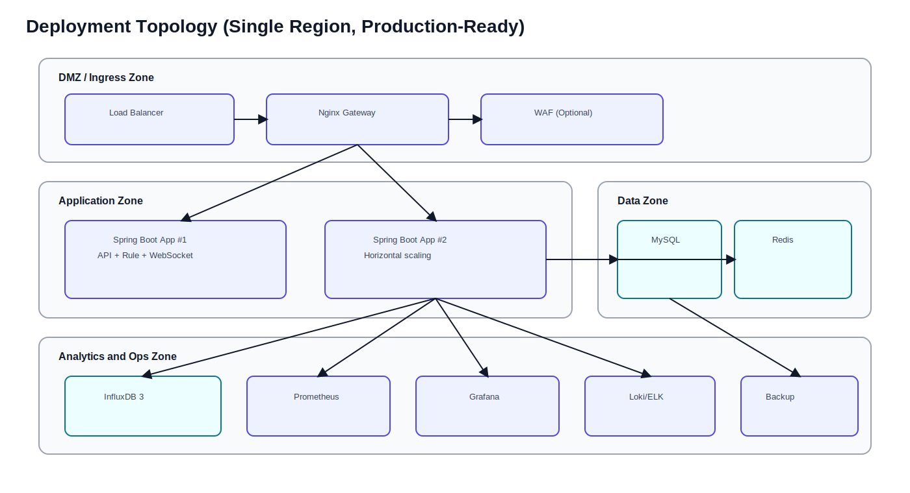
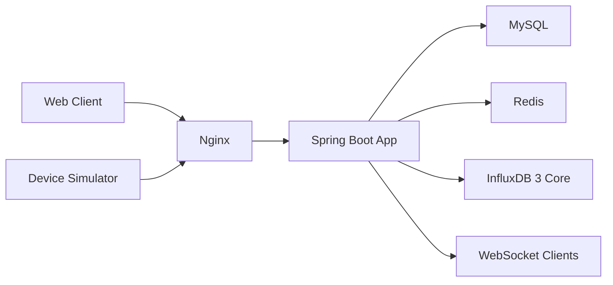

# 部署与运维文档

## 1. 环境分层
| 环境 | 目的 | 部署形态 |
|---|---|---|
| Dev | 本地开发联调 | Docker Compose |
| Stage | 预发布验证 | Docker Compose 或 K8s 单节点 |
| Prod | 稳定运行 | K8s 或多主机容器编排 |

## 2. 服务清单
1. `app`：Spring Boot 主服务。
2. `mysql`：关系数据库。
3. `redis`：缓存与流。
4. `influxdb3`：时序数据库。
5. `nginx`：网关与反向代理。
6. `prometheus`（可选）：指标采集。
7. `grafana`（可选）：可视化仪表盘。

## 3. 基础部署拓扑

图示说明：
1. Ingress、应用层、数据层、运维层做网络与权限分区。
2. Spring Boot 服务至少双实例，保证升级和故障时可用性。
3. 监控与日志组件独立部署，减少对主链路影响。

## 4. 基础部署拓扑（Mermaid 版）

## 5. 配置管理
### 5.1 环境变量分组
- 应用：`APP_PORT`、`SPRING_PROFILES_ACTIVE`
- MySQL：`MYSQL_HOST`、`MYSQL_PORT`、`MYSQL_DB`、`MYSQL_USER`
- Redis：`REDIS_HOST`、`REDIS_PORT`、`REDIS_PASSWORD`
- Influx：`INFLUX_URL`、`INFLUX_TOKEN`、`INFLUX_DB`
- 安全：`JWT_SECRET`、`JWT_EXPIRE_SECONDS`

### 5.2 配置原则
1. 机密配置不入库，统一用环境变量或密钥管理。
2. 配置按环境隔离，避免串环境。
3. 规则阈值配置持久化并可热加载。

## 6. 发布策略
1. 主干开发 + Tag 版本发布（如 `v1.2.0`）。
2. 灰度发布：先小流量验证，再全量切换。
3. 回滚策略：保留上一个稳定镜像，失败一键回退。

## 7. 可观测性设计
### 7.1 指标
1. API：QPS、P95、4xx/5xx 比例。
2. Stream：积压长度、消费延迟、死信数量。
3. DB：慢查询数、连接池利用率。
4. JVM：堆内存、GC次数、线程池队列长度。

### 7.2 日志
1. 应用日志采用统一 pattern，并固定输出 `traceId`（`%X{traceId}`）。
2. 请求日志保持“每个请求一行”，至少包含 `method`、`path`、`status`、`durationMs`、`traceId`。
3. 401/403 日志输出简要原因（含 `traceId` + `method` + `path` + `reason`）。
4. 全局兜底异常输出完整异常栈（含 `traceId` + `method` + `uri`）。
5. 同时输出控制台和滚动文件日志，文件路径为 `logs/app.log`。

### 7.3 告警
1. API 错误率超过阈值告警。
2. Stream 积压持续增长告警。
3. DB/Redis/Influx 不可用告警。

## 8. 数据备份与恢复
1. MySQL：每日全量备份 + 每小时 binlog 增量备份。
2. Redis：AOF + 定期 RDB 快照。
3. InfluxDB：按策略定期导出聚合数据。
4. 恢复演练：每月执行一次恢复演练并记录结果。

## 9. 运维 Runbook（简版）
### 9.1 API 5xx飙升
1. 检查最近发布版本与配置变更。
2. 优先按 `traceId` 检索 `logs/app.log`，定位首个兜底异常栈。
3. 必要时回滚到上一个稳定版本。

### 9.2 Stream 积压
1. 检查消费者存活和消费速率。
2. 临时提升消费者实例数。
3. 排查是否存在异常消息导致重试风暴。

### 9.3 数据库慢查询
1. 采样慢 SQL。
2. 检查索引命中率与执行计划。
3. 进行索引优化或冷热分离。

## 10. 容量规划建议
1. 先按日均峰值的 3 倍作为容量基线。
2. 事件吞吐增长后优先扩容消费者和 Redis。
3. 查询压力增长后优先优化缓存与时序聚合层。
